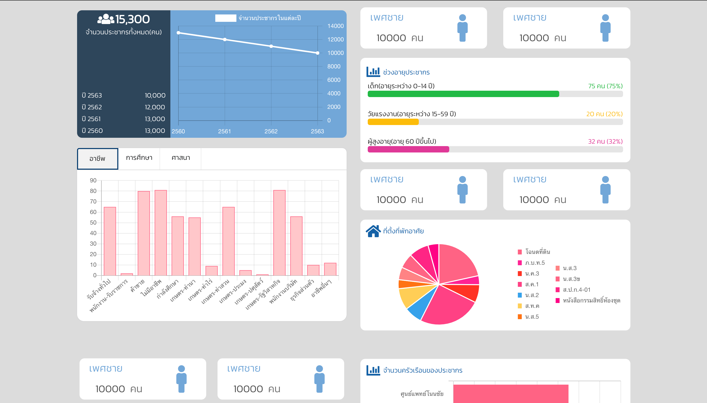
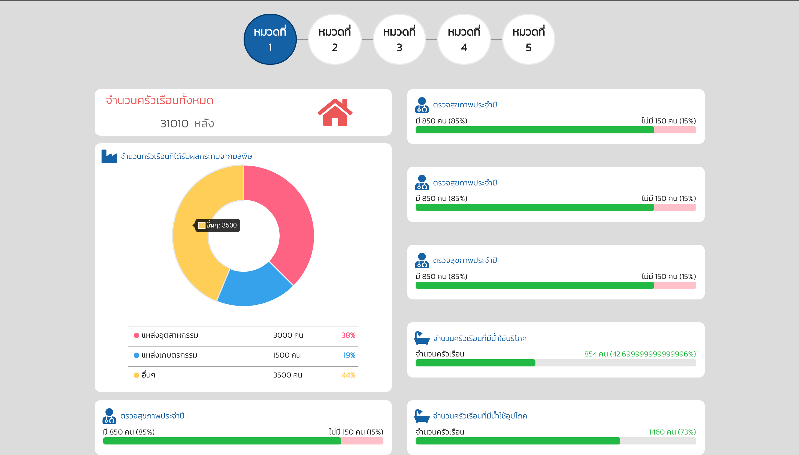
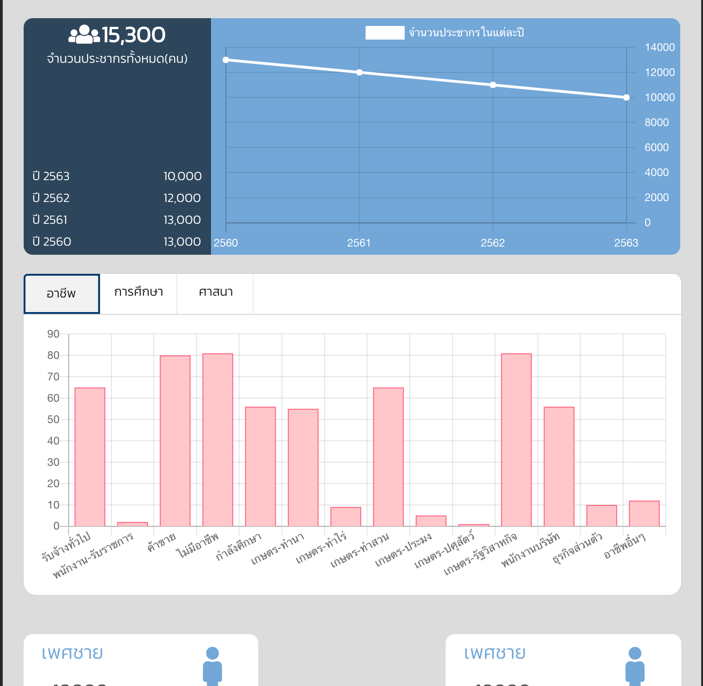

# Dashboard components

this project i build when i'm intern in One Geo Survey company.  
which library that i use to create dashboard is Chartjs and MaterialUI for responsive design  

when finish i need to get all of this component to real project and make it work with api  

